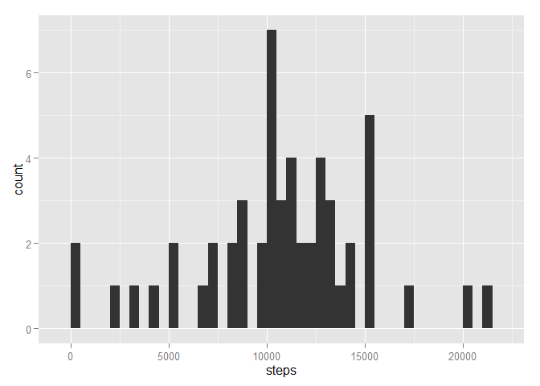
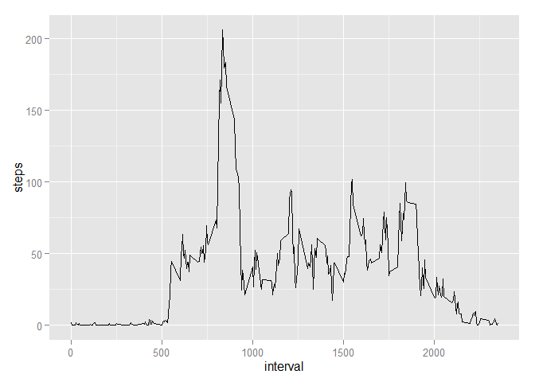
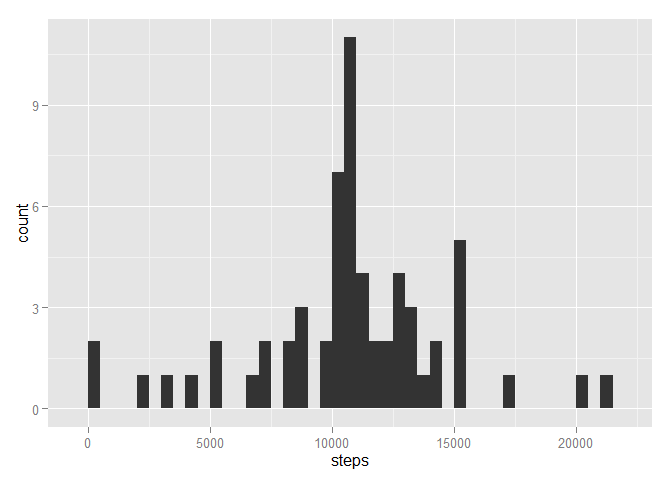
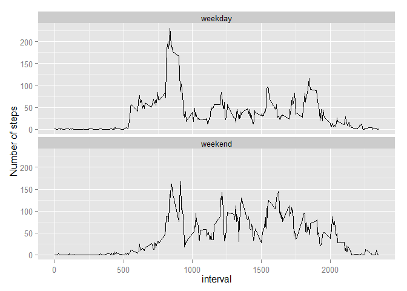

# Reproducible Research: Peer Assessment 1

## Contents

- Introduction
- Loading and preprocessing the data
- What is the mean total number of steps taken per day?
- What is the average daily activity pattern?
- Imputing missing values
- Are there differences in activity patterns between weekdays and weekends?

## Introduction

This report addresses Peer Assessment 1 of the Reproducible Research Course.  
The following code was developed and tested in R for Windows (it may require modification  
for use on Mac/ Linux systems).

All plots are prepared using the ggplot2 library which is called but assumed already installed.  
The code also uses the reshape2 library for melting and casting dataframes, this library is again called but is assumed already installed.

## Loading and preprocessing the data

The following R code unzips the data zip file (assumed to be in the R working directory) and loads the csv file.    


```r
## unzip the zip file and read the csv file
unzip("activity.zip")
activity <- read.csv("activity.csv")
```

The following code opens the necessary libraries ggplot2 (used for all plots) and reshape2, used for  
melting and casting dataframes.  

It also preprocesses the data to create suitable date formats and to omit rows of NA data that would be          problematic for the mean calculations (this does not affect the calculations of total steps).


```r
## open necessary libraries, note using ggplot2 for all plots (assumes packages already installed)
library(ggplot2)
library(reshape2)

## format date entries in proper date format
activityProcessedfull <-activity
activityProcessedfull$date <- as.Date(activityProcessedfull$date, "%Y-%m-%d")

## remove NAs from data (problematic for mean calculation)
activityProcessed <- na.omit(activityProcessedfull)
```

## What is mean total number of steps taken per day?

The following code creates a histogram of the total number of steps taken each day.  
That is within the range of steps in each band set by binwidth (500 set below) it shows the count of  
how many times this number of steps was made across the days.  


```r
## melt the dataframe, measured variables are "steps", to be shown by "date" and "interval"
## this melt file meets the requirements for analysis by date and later by interval
activityMelt <- melt(activityProcessed, id.vars =c("date", "interval"), measure.vars = "steps")

## cast dataframe to give total ie sum of steps (variable) for each date
activityCast <- dcast(activityMelt, date ~ variable, sum)


## create ggplot with appropriate axes
plot <- ggplot(activityCast, aes(x = steps, stat = "bin"))

## add histogram
plot <- plot + geom_histogram(binwidth = 500)
                                  
print(plot)
```

 

The following code calculates the mean and median total number of steps taken per day.  


```r
## calculate the mean of the total number of steps for each day from the "activityCast" dataframe
meanNoreplacesteps <- mean(activityCast$steps, na.rm = TRUE)

print(meanNoreplacesteps)
```

```
## [1] 10766
```

```r
## calculate the median of the total number of steps for each day from the "activityCast" dataframe
medianNoreplacesteps <- median(activityCast$steps, na.rm = TRUE)

print(medianNoreplacesteps)
```

```
## [1] 10765
```

This shows that:  
- the mean total number of steps taken per day is 1.0766 &times; 10<sup>4</sup>.  
- the median total number of steps taken per day is 10765.

## What is the average daily activity pattern?

The following code produces a time series plot of the 5-minute interval (x axis) and the average number  
of steps taken, averaged across all days (y axis).  It does this by casting a table "activityCastmean"  
which gives for each inverval the mean number of steps over all days.


```r
## cast dataframe to give average (mean) steps (variable) for each interval
## can use the same "activityMelt"" dataframe as before and re cast for the different summary
activityCastmean <- dcast(activityMelt,  interval ~ variable, mean)

## create ggplot with appropriate axes
plot2 <- ggplot(activityCastmean, aes(x = interval, y = steps))

## add timeseries line
plot2 <- plot2 + geom_line()

print(plot2)
```

 

The following code calculates the maximum mean number of steps from any 5 minute interval averaged across   all the days.  This is the maximum value of steps from the "activityCastmean"" table.  
The code then identifies the corresponding "interval" value(s) for which this maximum occurs.  


```r
## maximum average number of steps for any interval
maxAvSteps <- max(activityCastmean$steps)

print(maxAvSteps)
```

```
## [1] 206.2
```

```r
## intervals where this maximum number of steps arises

intervalId <- which(activityCastmean$steps == maxAvSteps)
intervalMax <- activityCastmean$interval[intervalId]

print(intervalMax)
```

```
## [1] 835
```

This shows that:  
- the maximum number of steps on average in any interval was 206.1698  
- this maximum arose in interval 835  

## Imputing missing values

The total number of missing values in the dataset (i.e. rows with NAs) is calculated by   
the following code, which identifies NAs in the steps column of the original activity dataset:  


```r
missingvalues <- sum(is.na(activity$steps))
print(missingvalues)
```

```
## [1] 2304
```

This shows that the number of rows where there are NAs representing missing data is 2304.  

The strategy chosen for filling in the missing values in the dataset is to replace missing interval values with the previously calculated mean value (across all days) for that same interval.  

The code to create the new dataset with imputed values ("activityReplaced") is set out below.  

After creating the variable to hold the new data set "activityReplaced" and initially setting it to the   
full (before omissions were removed) dataset ("activityProcessedfull") a loop is then used to carry out   
the replacement as follows:

The loop runs over every row in the dataset.  It first checks whether the "steps" entry is an "NA"  
If the entry is an NA then the loop does the following:  
- identifies the corresponding interval for this entry  
- finds the row number ("rowNum") of this interval in the table of replacement values  
- identifies the correct replacement value "meanSteps" from the table of replacement values  
- replaces the missing value with the replacement "meanSteps" value  
- the loop continues through all observations in the dataset (no action is taken where the steps value is not missing)


```r
## use the sugggested strategy to replace NAs with the mean value for that interval
## these replacement values have already been calculated in the "activityCastmean" table

## create new activity dataset to hold original and replaced missing data 
activityReplaced <- activityProcessedfull
    
for(i in 1:nrow(activityReplaced)){
    if(is.na(activityReplaced$steps[i])){  ## if missing steps value then make replacement
        
        ## get the interval for this measurement
        intervalId <- activityReplaced$interval[i] ## identify the interval with the missing value
        
        ## find this interval in the table of mean steps by interval
        rowNum <- which(activityCastmean$interval %in% intervalId)

        ## set the mean number of steps to the mean for this interval from the activityCastmean table
        meanSteps <- activityCastmean$steps[rowNum]            
                        
        ## replace the missing data with the calculated mean value
        activityReplaced$steps[i] <- meanSteps
    }
    ## If there isn't an NA entry in the steps for this row, then move on to the next row 
}
```

The following code produces a histogram of the total number of steps taken each day using this revised   dataset with imputed missing values:  


```r
## melt the dataframe, measured variables are "steps", to be shown by "date"
activityReplacedMelt <- melt(activityReplaced, id.vars =c("date", "interval"), measure.vars = "steps")

## cast dataframe to give total steps (variable) for each date
activityReplacedCast <- dcast(activityReplacedMelt, date ~ variable, sum)


## create ggplot with appropriate axes
plot3 <- ggplot(activityReplacedCast, aes(x = steps, stat = "bin"))

## add histogram
plot3 <- plot3 + geom_histogram(binwidth = 500)

print(plot3)
```

 

The following code calculates the revised mean and median values for this revised dataset including imputed missing values using the summary in the "activityReplacedCast" table:  


```r
meanReplacedsteps <- mean(activityReplacedCast$steps)

print(meanReplacedsteps)
```

```
## [1] 10766
```

```r
medianReplacedsteps <- median(activityReplacedCast$steps)

print(medianReplacedsteps)
```

```
## [1] 10766
```

These values compare to the calculations produced in the first part of this report as follows:

Mean:  
- Dataset with NAs----------------------------Mean = 1.0766 &times; 10<sup>4</sup>  
- Dataset with imputed values replacing NAs---Mean = 1.0766 &times; 10<sup>4</sup>  

Median:  
- Dataset with NAs----------------------------Median = 10765  
- Dataset with imputed values replacing NAs---Median = 1.0766 &times; 10<sup>4</sup>  

The result of imputing missing data using the given strategy is that the resulting mean value is unchanged.  
This is to be expected, as the replacement values represent mean values of the existing data.  

The resulting median with the imputed data is slightly different from the previous median calculation  
before replacement of missing data. This is not surprising as while the mean stays the same, the median  
is affected by the relative positioning ie order of the new data in the dataset.

## Are there differences in activity patterns between weekdays and weekends?

The following code creates a new factor variable with two levels "weekday" and "weekend" indicating whether a given date is a weekday or a weekend day in a vector "dayCategory". This is then attached to the full  
dataset ("activityReplaced") using the cbind function:    


```r
## using the activityReplaced dataset
## identify the day of the week for each day in the dataset
dayCategory <- weekdays(activityReplaced$date)

## replace day with weekday or weekend

dayCategory[dayCategory == "Saturday" | dayCategory == "Sunday"] <- "weekend"
dayCategory[dayCategory != "weekend"] <- "weekday"

## add this as a column to the dataset
activityReplaceddayType <- cbind(activityReplaced, dayCategory)
```

The following code creates a panel plot containing a time series plot of the 5-minute interval (x-axis)  
and the average number of steps taken, averaged across all weekday days or weekend days (y-axis).  
A facet plot is used in ggplot2 (using facet_wrap) with two rows to create a separate plot for  
weekday days and weekend days.   


```r
## create a panel plot containing a time series plot of the 5 minute interval (x axis) and
## average number of steps taken, averaged across all weekday days or weekend days (y axis)

## melt the dataframe, measured variables are "steps", to be shown by "interval" and "dayCategory"
activityReplaceddayTypemelt <- melt(activityReplaceddayType, id.vars =c("dayCategory", "interval"), measure.vars = "steps")

## cast dataframe to give average (mean) steps (variable) for each interval
activityReplaceddayTypecast <- dcast(activityReplaceddayTypemelt, dayCategory + interval ~ variable, mean)

## create ggplot with appropriate axes and set y axis title to Number of steps
plot4 <- ggplot(activityReplaceddayTypecast, aes(x = interval, y = steps)) + ylab("Number of steps")

## add grid of line graphs for each daytype
plot4 <- plot4 + geom_line() + facet_wrap(~dayCategory, nrow = 2)

print(plot4)
```

 

The plot shows that there is a difference in the activity pattern between weekday days (on average) and weekend days (on average).
